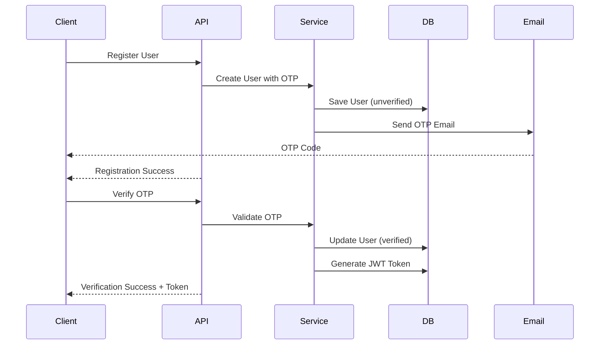
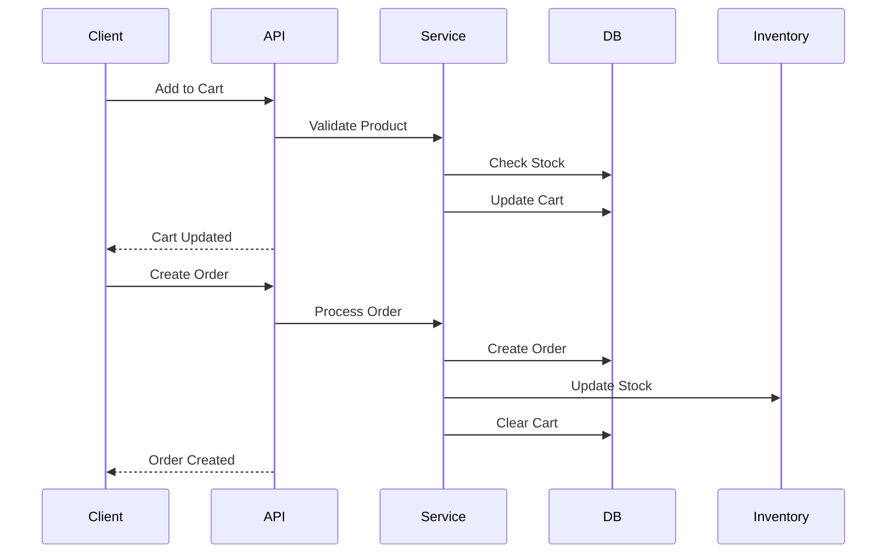

# Tawin Server - System Documentation

## Table of Contents

1. [System Overview](#system-overview)
2. [Business Purpose](#business-purpose)
3. [Technology Stack](#technology-stack)
4. [Folder/Project Structure](#folderproject-structure)
5. [Route/Controller/Service/Model Flow](#routecontrollerservicemodel-flow)
6. [Authentication and Authorization Flow](#authentication-and-authorization-flow)
7. [Database Design](#database-design)
8. [Important Data Flows](#important-data-flows)
9. [File Upload Flow](#file-upload-flow)
10. [Environment Variables](#environment-variables)
11. [Deployment Architecture](#deployment-architecture)
12. [Security Considerations](#security-considerations)
13. [API Documentation](#api-documentation)
14. [Development Workflow](#development-workflow)
15. [Production Workflow](#production-workflow)
16. [Assumptions](#assumptions)

---

## System Overview

Tawin Server is a comprehensive Express.js TypeScript backend API for an e-commerce platform with multilingual support, user management, product catalog, order processing, and administrative features. The system supports Arabic and English languages, implements JWT-based authentication, role-based access control, and provides RESTful APIs with comprehensive Swagger documentation.

---

## Business Purpose

The backend serves as the core API for an e-commerce platform that:

- Manages user accounts with email verification and OTP-based authentication
- Provides a product catalog with categories, brands, and inventory management
- Handles shopping cart, wishlist, and order processing workflows
- Supports administrative functions for staff management and system settings
- Enables file uploads for product images, user avatars, and documents
- Offers multilingual support (English/Arabic) for international markets

---

## Technology Stack

### Core Framework

- **Node.js** with **Express.js 5.2.1** - Web framework
- **TypeScript 5.9.3** - Type-safe JavaScript
- **MongoDB 8.23.0** with **Mongoose ODM** - Database and ORM

### Frontend

- **React 19.1.0** - Frontend framework
- **Next.js 16.0.0** - React framework
- **shadcn/ui 2.0.0** - UI components

### Authentication & Security

- **JWT (jsonwebtoken 9.0.3)** - Token-based authentication
- **bcryptjs 3.0.2** - Password hashing
- **Helmet 8.1.0** - Security headers
- **express-rate-limit 8.3.2** - Rate limiting

### Validation & Data Handling

- **Zod 4.3.6** - Schema validation
- **express-validator 7.3.1** - Request validation
- **Lodash 4.18.1** - Utility functions

### File Handling

- **Multer 2.1.0** - File uploads
- **Slugify 1.6.8** - URL slug generation

### Internationalization

- **i18next 25.8.13** - Internationalization
- **i18next-fs-backend 2.6.1** - File system backend
- **i18next-http-middleware 3.9.2** - Express middleware

### Email & Communication

- **Nodemailer 8.0.2** - Email sending
- **Date-fns 4.1.0** - Date manipulation

### Documentation & Development

- **Swagger-jsdoc 6.2.8** & **Swagger-ui-express 5.0.1** - API documentation
- **Winston 3.19.0** - Logging
- **Nodemon 3.1.14** - Development auto-restart
- **PM2** (via ecosystem.config.js) - Production process management

---

## Folder/Project Structure

```
tawin_server/
├── src/
│   ├── app.ts                    # Express app configuration
│   ├── server.ts                 # Server entry point
│   ├── config/                   # Configuration files
│   │   ├── constants.ts          # Application constants
│   │   ├── cors.ts               # CORS configuration
│   │   ├── db.ts                 # Database connection
│   │   ├── env.config.ts         # Environment variables
│   │   ├── i18n.ts               # Internationalization config
│   │   ├── logger.ts             # Winston logger setup
│   │   ├── multer.config.ts      # File upload configuration
│   │   └── swagger.ts            # Swagger documentation setup
│   ├── middlewares/              # Express middlewares
│   │   ├── auth.middleware.ts    # JWT authentication
│   │   ├── error.middleware.ts   # Global error handling
│   │   ├── rateLimiter.middleware.ts # Rate limiting
│   │   ├── trackUploadedFiles.middleware.ts # File tracking
│   │   ├── upload.middleware.ts  # File upload handling
│   │   └── validate.middleware.ts # Request validation
│   ├── modules/                  # Feature modules
│   │   ├── auth/                 # Authentication module
│   │   │   ├── auth.controller.ts
│   │   │   ├── auth.routes.ts
│   │   │   ├── auth.service.ts
│   │   │   ├── auth.types.ts
│   │   │   └── auth.validation.ts
│   │   ├── user/                 # User management
│   │   ├── product/              # Product catalog
│   │   ├── category/             # Product categories
│   │   ├── order/                # Order processing
│   │   ├── cart/                 # Shopping cart
│   │   ├── favorite/             # Wishlist
│   │   ├── review/               # Product reviews
│   │   ├── address/              # User addresses
│   │   ├── staff/                # Staff management
│   │   ├── admin/                # Admin functions
│   │   ├── brand/                # Product brands
│   │   ├── supplier/             # Supplier management
│   │   ├── coupon/               # Discount coupons
│   │   ├── contact/              # Contact management
│   │   ├── notification/         # Notifications
│   │   └── settings/             # System settings
│   ├── routes/                   # Route definitions
│   │   └── index.ts              # Root router
│   ├── services/                 # Shared services
│   │   ├── email.service.ts      # Email functionality
│   │   └── ...                   # Other shared services
│   ├── utils/                    # Utility functions
│   │   ├── apiResponse.ts        # Response formatting
│   │   ├── apiError.ts           # Error handling
│   │   ├── asyncHandler.ts       # Async wrapper
│   │   ├── context.ts            # Request context
│   │   └── ...                   # Other utilities
│   ├── types/                    # TypeScript type definitions
│   └── jobs/                     # Background jobs
├── locales/                      # Translation files
│   ├── en.json                   # English translations
│   └── ar.json                   # Arabic translations
├── logs/                         # Log files
├── uploads/                      # File upload directory
├── docs/                         # Documentation
├── .env.example                  # Environment variables template
├── ecosystem.config.js           # PM2 configuration
├── package.json                  # Dependencies and scripts
├── tsconfig.json                 # TypeScript configuration
└── README.md                     # Project documentation
```

### Flow Description:

1. **Routes** (`*.routes.ts`) - Define API endpoints and apply middleware
2. **Controllers** (`*.controller.ts`) - Handle HTTP requests/responses, call services
3. **Services** (`*.service.ts`) - Implement business logic, interact with models
4. **Models** (`*.model.ts`) - Define data schemas and database operations
5. **Validation** (`*.validation.ts`) - Request validation schemas using Zod/express-validator

## Authentication and Authorization Flow

### Authentication Features:

- **JWT-based authentication** with access tokens
- **Role-based access control** (admin, customer, staff)
- **Permission system** for staff with module-level operations
- **OTP-based email verification** for account activation
- **Password reset** functionality with email tokens
- **Session management** with last logout tracking

---

## Database Design

#### Users Collection

```javascript
{
  _id: ObjectId,
  firstName: String,
  lastName: String,
  username: String (unique, indexed),
  email: String (unique, indexed),
  password: String (hashed, select: false),
  isVerified: Boolean (default: false),
  role: String (enum: ['admin', 'customer']),
  phone: String,
  profileImage: String,
  lastLogout: Date,

  // OTP Fields (select: false)
  verificationOtp: String,
  verificationOtpExpires: Date,
  verificationOtpLastSent: Date,

  // Password Reset Fields (select: false)
  passwordResetToken: String,
  passwordResetExpires: Date,

  // Construction Basket Application
  constructionBasket: {
    isApplied: Boolean,
    status: String (enum: ['pending', 'approved', 'rejected']),
    fullRegistrationName: String,
    phoneNumber: String,
    monthlyIncome: Number,
    occupation: String,
    unifiedCard: String,
    residenceCard: String,
    propertyArea: String,
    propertyType: String (enum: ['Freehold', 'Leasehold']),
    country: String
  },

  timestamps: { createdAt: Date, updatedAt: Date }
}
```

#### Products Collection

```javascript
{
  _id: ObjectId,
  title: { en: String, ar: String },
  slug: String (unique),
  category: ObjectId (ref: 'Category'),
  description: { en: String, ar: String },
  price: Number,
  originalPrice: Number,
  photo: String,
  images: [String],
  variant: String,
  remainingPieces: Number,
  isNewArrival: Boolean,
  isFeatured: Boolean,
  discount: Number,
  rating: Number (min: 0, max: 5),
  reviewCount: Number,
  timestamps: { createdAt: Date, updatedAt: Date }
}
```

#### Categories Collection

```javascript
{
  _id: ObjectId,
  name: { en: String, ar: String },
  slug: String (unique),
  thumbnail: String,
  description: { en: String, ar: String },
  type: String (enum: ['category', 'brand']),
  parentCategory: ObjectId (ref: 'Category', default: null),
  timestamps: { createdAt: Date, updatedAt: Date }
}
```

#### Orders Collection

```javascript
{
  _id: ObjectId,
  user: ObjectId (ref: 'User'),
  items: [{
    product: ObjectId (ref: 'Product'),
    quantity: Number,
    price: Number
  }],
  totalAmount: Number,
  discountAmount: Number,
  finalAmount: Number,
  shippingAddress: {
    label: String,
    street: String,
    city: String,
    state: String,
    zipCode: String,
    country: String
  },
  shippingType: String (enum: ['free', 'express']),
  phone: String,
  paymentMethod: String (enum: ['COD']),
  status: String (enum: ['pending', 'processing', 'shipped', 'delivered', 'cancelled']),
  couponCode: String,
  timestamps: { createdAt: Date, updatedAt: Date }
}
```

## Important Data Flows

### User Registration & Verification Flow



### Product Purchase Flow



### File Upload Flow

### Upload Configuration:

- **File Size Limit**: 5MB per file
- **Supported Image Types**: JPEG, PNG, WebP
- **Supported Document Types**: PDF
- **Storage Paths**:
  - Profile Images: `uploads/avatars/`
  - Product Images: `uploads/products/`
  - Documents: `uploads/documents/`
  - Others: `uploads/others/`

---

## Environment Variables

Based on `.env.example`:

```bash
# Server Configuration
PORT=
MONGO_URI=
CORS_ORIGIN=*
JWT_SECRET=my_jwt_secret

# Database Credentials
DB_USER=
DB_USER_PASS=

# Email Service Configuration
EMAIL_SERVICE=true
MAIL_MAILER=
MAIL_HOST=
MAIL_PORT=
MAIL_USERNAME=
MAIL_PASSWORD=
MAIL_ENCRYPTION=
MAIL_FROM_ADDRESS=

# Business Configuration
LOW_STOCK_THRESHOLD=
```

### Required Variables:

- `PORT`: Server port number
- `MONGO_URI`: MongoDB connection string
- `JWT_SECRET`: Secret for JWT token signing
- `LOW_STOCK_THRESHOLD`: Inventory alert threshold

### Optional Variables:

- `CORS_ORIGIN`: Allowed origins (defaults to \*)
- `EMAIL_SERVICE`: Enable/disable email functionality
- Mail configuration variables for SMTP setup
- Database credentials if using authenticated MongoDB

---

## Deployment Architecture

### Deployment Configuration:

- **Process Manager**: PM2 with ecosystem.config.js
- **Process Mode**: Fork mode with 1 instance (configurable)
- **Auto-restart**: Enabled on crashes
- **Memory Limit**: 1GB per process
- **Environment**: Production mode optimizations
- **Static Files**: Served from `/uploads` directory
- **Health Check**: `/health` endpoint for monitoring

---

## Security Considerations

### Implemented Security Measures:

1. **Helmet.js**: Security headers (CSP, HSTS, etc.)
2. **CORS**: Configurable cross-origin resource sharing
3. **Rate Limiting**: API request rate limiting
4. **JWT Authentication**: Secure token-based authentication
5. **Password Hashing**: bcryptjs for password security
6. **Input Validation**: Zod and express-validator for request validation
7. **File Upload Security**: Type and size validation
8. **Environment Variables**: Sensitive data in environment files
9. **Error Handling**: Safe error messages in production

### Security Best Practices:

1. **Password Requirements**: Minimum 8 characters
2. **OTP Expiration**: Time-limited verification codes
3. **Token Expiration**: JWT tokens with reasonable expiry
4. **Role-Based Access**: Granular permission system
5. **Input Sanitization**: Validation and sanitization of all inputs
6. **File Type Restrictions**: Limited file types for uploads
7. **SQL Injection Prevention**: Mongoose ODM protection
8. **XSS Prevention**: Input validation and output encoding

---

## API Documentation

### Swagger Documentation:

- **URL**: `http://localhost:PORT/api-docs`
- **JSON Spec**: `http://localhost:PORT/api-docs.json`
- **UI**: Swagger UI Express interface

### Documentation Features:

1. **Comprehensive API Coverage**: All endpoints documented
2. **Request/Response Schemas**: Detailed schema definitions
3. **Authentication Examples**: Bearer token examples
4. **Error Responses**: Standardized error formats
5. **Multi-language Support**: Internationalized descriptions
6. **Interactive Testing**: Try-it-out functionality
7. **Tag Organization**: Grouped by feature modules

### API Standards:

- **RESTful Design**: Proper HTTP methods and status codes
- **Consistent Responses**: Standardized API response format
- **Error Handling**: Consistent error response structure
- **Pagination**: Standardized pagination for list endpoints
- **Filtering**: Query parameter filtering support
- **Sorting**: Configurable sorting options

---

## Development Workflow

### Setup Process:

```bash
# 1. Clone repository
git clone <repository-url>
cd tawin_server

# 2. Install dependencies
npm install

# 3. Set up environment variables
cp .env.example .env
# Edit .env with appropriate values

# 4. Start development server
npm run dev
```

### Development Scripts:

- `npm run dev`: Development server with hot reload
- `npm run build`: Build TypeScript to JavaScript
- `npm start`: Production server start
- `npm run prod`: Production mode execution

### Development Features:

1. **Hot Reload**: Nodemon with ts-node
2. **TypeScript**: Type-safe development
3. **Environment Management**: Development/production configs
4. **Debug Logging**: Enhanced logging in development
5. **API Documentation**: Auto-generated Swagger docs
6. **File Watching**: Automatic restart on file changes

### Code Organization:

1. **Module Structure**: Feature-based organization
2. **Separation of Concerns**: Clear layer separation
3. **Type Safety**: Comprehensive TypeScript usage
4. **Validation**: Input validation at multiple levels
5. **Error Handling**: Centralized error management
6. **Logging**: Structured logging throughout

---

## Production Workflow

### Build Process:

```bash
# 1. Build TypeScript
npm run build

# 2. Start with PM2
pm2 start ecosystem.config.js

# 3. Monitor processes
pm2 list
pm2 logs
pm2 monit
```

### Production Configuration:

1. **Environment**: Production Node environment
2. **Logging**: File-based logging only
3. **Error Handling**: Generic error messages
4. **Performance**: Optimized for production
5. **Security**: Enhanced security measures
6. **Monitoring**: PM2 process monitoring

### Deployment Steps:

1. **Code Deployment**: Pull latest code
2. **Build Application**: Compile TypeScript
3. **Install Dependencies**: Production dependencies only
4. **Environment Setup**: Configure production variables
5. **Database Migration**: Apply database changes
6. **Start Services**: Start with PM2
7. **Health Check**: Verify application health
8. **Monitor Setup**: Configure monitoring and alerts

### Production Considerations:

1. **Database**: Production MongoDB instance
2. **File Storage**: Persistent file storage
3. **Email Service**: Production SMTP configuration
4. **SSL/TLS**: HTTPS configuration
5. **Backup Strategy**: Regular database backups
6. **Monitoring**: Application and server monitoring
7. **Log Rotation**: Log file management
8. **Security Updates**: Regular dependency updates

---

## Assumptions

1. **MongoDB Availability**: MongoDB database is properly configured
2. **Email Service**: SMTP server is configured for email functionality
3. **File Storage**: Sufficient disk space for file uploads
4. **Network Connectivity**: Internet access for external services
5. **Environment Variables**: All required variables are properly set

---

## Conclusion

Tawin Server is a well-structured, feature-rich e-commerce backend API that provides a solid foundation for an online shopping platform. The system demonstrates good software engineering practices with proper separation of concerns, comprehensive error handling, security measures, and internationalization support.

The modular architecture allows for easy maintenance and scalability, while the comprehensive documentation and logging facilitate development and operations. The system is production-ready with proper configuration management, process monitoring, and security considerations.

For any development team taking over this project, the documentation provides a complete understanding of the system architecture, data flows, and operational procedures. The codebase follows TypeScript best practices and implements modern web development standards, making it maintainable and extensible for future requirements.
